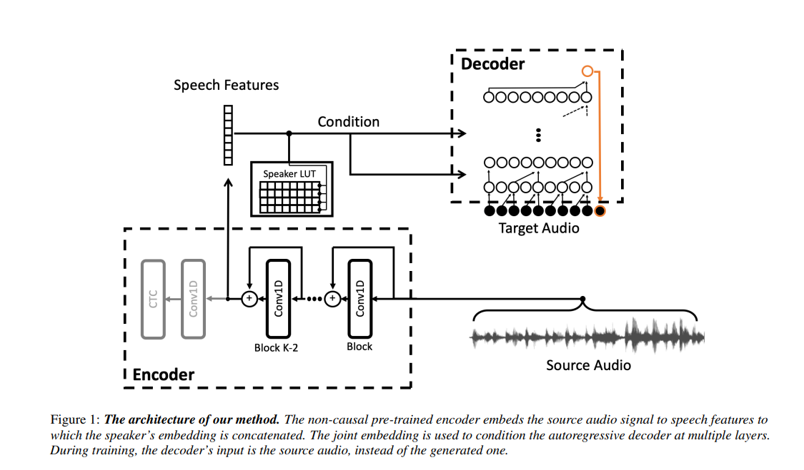

# 100-days-of-code
My 100 days journey with coding to improve my Machine Learning, Deep Learning, Data Science skills

## Day 1
I continued with wav2wav #autoencoder for audio style transfer. Loss decreased gradually during the training, so I've started writing audio generation script Nuty Also, I've added json configuration files with parameters of e.g. melspectrogram.

* Wav2wav autoencoder: https://arxiv.org/pdf/1904.08983.pdf

## Day 2
Had a little fun with casual convolutions in wav-to-wav autoencoder in #pytorch. Reimplemented&tried to understand it better. Later, experimented a bit with different architectures.

* Casual convolutions: https://medium.com/the-artificial-impostor/notes-understanding-tensorflow-part-3-7f6633fcc7c7

## Day 3
I came up with an idea for a fun project  after working hours. I always wanted to train GANs but popular datasets seemed boring -> I started scraping data with Selenium! It's my first time trying it out and first successfully clicked button felt awesome

* Selenium: https://www.selenium.dev/
* Selenium for data scraping: https://medium.com/the-andela-way/introduction-to-web-scraping-using-selenium-7ec377a8cf72
* BeautifulSoup: https://www.crummy.com/software/BeautifulSoup/bs4/doc/

## Day 4
Started generating random RPG-like pixel characters with LPC spritesheet: http://tinyurl.com/yb6yg7kw. I'm creating my own dataset for my experiment with Generative Adversarial Networks. Soon I'll start implementing it in #pytorch 

* LPC spritesheet: http://tinyurl.com/yb6yg7kw.
* Pytorch: https://pytorch.org/

My notebooks:
* [Download random spritesheet with Selenium](https://github.com/AgaMiko/pixel_character_generator/blob/master/notebooks/1_download_random_spritesheet.ipynb)
* [Extract character from spritesheet](https://github.com/AgaMiko/pixel_character_generator/blob/master/notebooks/2_extract_character.ipynb)

       
       
       

## Day 5

 
 
